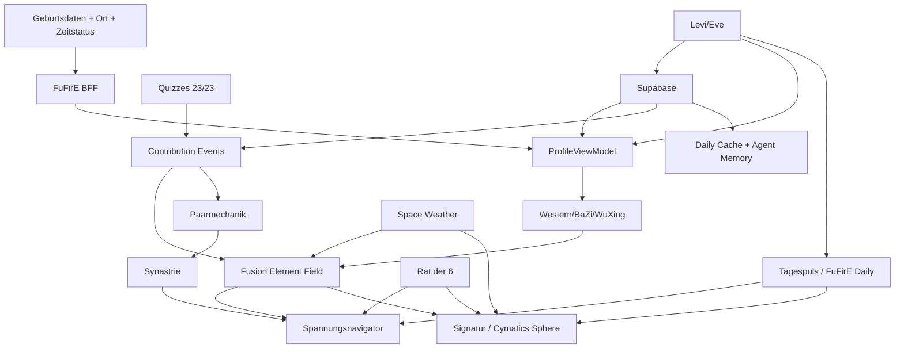

# New_Bazi Vollstaendiger Feature- und Implementierungsueberblick V2

Stand: 2026-06-11
Modus: Ultrathink-Craftsmanship + Software-Documentation-Architect
Datenbasis: statische Analyse von `/mnt/data/New_Bazi-main (1).zip`, vorhandene lokale Extrakte, vorheriger GitHub-Abgleich zu Astro-Noctum/Bazodiac und Nutzerzielbild.
Ziel: Alle genannten Features pruefen, falsch/ungenau formulierte Annahmen korrigieren, Astro-Noctum als Ersatzteillager sauber verknuepfen und daraus Bug Report, Feature Requests und Sprintplan ohne eigenmaechtige Scope-Entscheidung erstellen.

---

## 0. Executive Correction

Die vorige Fassung war an einer Stelle zu stark priorisierend: Das Signatur-Feature wurde als moeglicher Overhead bewertet. Das war keine valide Dokumentationsentscheidung, weil der Nutzer explizit einen vollstaendigen Feature- und Implementierungsueberblick verlangt. In dieser Version wird Signatur nicht weggelassen, sondern als eigenstaendiger Feature-Strang und Sprint aufgenommen.

Wichtig: Dieser Plan entscheidet nicht, ob Features zu komplex, unpassend oder spaeter zu streichen sind. Er dokumentiert:

1. Was in New_Bazi aktuell implementiert ist.
2. Was in Astro-Noctum/Bazodiac als Portierungsquelle belegt ist.
3. Was aus dem Nutzerzielbild als Feature Request in New_Bazi gehoert.
4. Welche Bugs, Luecken und Abhaengigkeiten vorliegen.
5. Welche Sprints noetig sind, damit aus New_Bazi eine Vollfeature-Version, daraus eine Beta-Tester-Version und spaeter eine Production-Version abgeleitet werden kann.

---

## 1. Projekt-Governance

### 1.1 Steuerungsannahme

**Annahme / Nutzerentscheidung:** Astro-Noctum wird nicht weiter als Produktentwicklungsziel gefuehrt, sondern dient als Ersatzteillager. New_Bazi wird die neue Vollfeature-Basis.

**Status:** Nicht aus Code belegbar, aber als Projekt-Governance verbindlich fuer diesen Plan uebernommen.

### 1.2 Konsequenz fuer Umsetzung

- Neue Featureentwicklung erfolgt in New_Bazi.
- Astro-Noctum wird nur noch fuer Portierung, Vergleich, Text-/UI-Artefakte, API-Vertraege und bewiesene Feature-Implementierungen genutzt.
- Feature-Entscheidungen werden nicht aus Astro-Noctum uebernommen, ohne sie in New_Bazi neu zu validieren.
- Alles, was aus Astro-Noctum portiert wird, braucht eine Portierungsmap: Quelle, Zielpfad, Datenvertrag, Test, Akzeptanzkriterium.

---

## 2. Evidenzbasis

### 2.1 New_Bazi - belegte Dateien

Relevante Dateien aus `/mnt/data/New_Bazi-main`:

- `src/App.tsx` - Tab-Routing und Feature-Einstieg.
- `src/components/InputForm.tsx` - Geburtsdatenformular.
- `src/components/Overview.tsx` - Uebersicht, Print-Report-Button.
- `src/components/WesternAstrology.tsx` - Westliche Details.
- `src/components/BaZiDetail.tsx` - BaZi-Saeulen, Daymaster, Dayun-Missing-State.
- `src/components/WuXingDetail.tsx` - Wu-Xing-Rad, Elementdetails, aktuell mit Coaching-Wording.
- `src/components/TensionNavigator.tsx` - Spannungsnavigator, Reaktionen, Herkunft-Layer, Paarmodus.
- `src/components/DailyPulse.tsx` - Tagespuls UI, Vor-/Ruecknavigation.
- `src/components/Synastry.tsx` - Partnerdaten, Synastrie, Paar-Spannungsnavigator.
- `src/server/app.ts` - Express-BFF, FuFirE-Endpunkte, Daily, Synastry, Dayun-Missing, Gemini optional.
- `src/utils/fufirePayloadMappers.ts` - Bootstrap/Daily Payloads, derzeit `quiz_sectors = soulprint_sectors`.
- `src/utils/fufireNormalizer.ts` - Normalisierung Western/BaZi/WuXing/Fusion.
- `src/utils/synastry.ts` - lokaler Synastrie-Vergleich.
- `src/utils/tensionNavigator.ts` - Element -> Polachsen.
- `src/utils/tensionReaction.ts` - vier Nutzerreaktionen.
- `docs/concept/spannungsnavigator-grundregeln.md` - Council-Regeln.
- `docs/concept/spannungsnavigator-visualisierung.md` - Signatur-/Visualisierungslogik.
- `docs/plans/2026-06-11-spannungsnavigator-mvp.md` - N1 Spannungsnavigator, N2/N3 Integrationsvertrag.

### 2.2 Astro-Noctum - belegte Ersatzteillager-Fakten

Aus vorherigem GitHub-Abgleich belegte Astro-Noctum-Fakten:

- Astro-Noctum/Bazodiac ist als Fusion-Astrology-Plattform fuer Western Astrology, BaZi und Wu-Xing dokumentiert.
- Astro-Noctum dokumentiert 23 kanonische Quiz-Definitionen: 22 spielbare Quizzes plus eine AI-driven Conversation Analysis.
- Astro-Noctum dokumentiert ElevenLabs Voice-Agent-Endpunkte fuer Levi/Eve.
- Astro-Noctum dokumentiert Supabase als Auth-/DB-/Profil-/Conversation-Infrastruktur.
- Astro-Noctum dokumentiert Space-Weather-/NASA-/NOAA-Endpunkte und Contribution-Logik.
- Astro-Noctum dokumentiert Signature/Fusion-Ring/Soulprint-Mechaniken, die fuer New_Bazi als Portierungsquelle genutzt werden koennen.

### 2.3 Nicht validierbare Aussagen

Die folgenden Aussagen koennen in dieser Analyse nicht direkt validiert werden:

- Ob Supabase gestern tatsaechlich gehaertet wurde und alle Warnungen entfernt sind. In New_Bazi sind aktuell keine Supabase-Abhaengigkeit und keine Supabase-Env-Konfiguration sichtbar.
- Ob die NASA-Keys wirklich in deiner lokalen `.env` liegen. Die ZIP enthaelt nur `.env.example`; echte `.env` wird berechtigterweise nicht mitgeliefert.
- Ob ElevenLabs wegen Hack aktuell Free Mode ist. Das ist Account-Zustand, nicht Repo-Zustand.
- Ob bazodiac.space live alle Texte korrekt eingebunden hat. Das wurde hier nicht live gescraped; Texte muessen aus Astro-Noctum-Repo/Content-Export oder Live-Audit uebernommen werden.
- Ob der konkrete Screenshot-Bug mit Mond/Aszendent reproduzierbar ist. Screenshotdaten liegen hier nicht vor. Der Bug ist als Repro-/Mapping-Issue aufgenommen.

---

## 3. Aktueller New_Bazi Feature-Status

| Feature | New_Bazi Ist-Zustand | Astro-Noctum Quelle | Zielstatus |
|---|---|---|---|
| Geburtsdaten-Eingabe | implementiert; Zeit Pflicht | teilweise vorhanden | ausbauen um `Uhrzeit unbekannt` |
| Place/Timezone | implementiert ueber Photon + tz-lookup | andere Loesungen moeglich | stabilisieren, Fallbacks |
| FuFirE Profil | implementiert | BAFE/FuFirE Proxy in Astro-Noctum | beibehalten, Contracts haerten |
| Western Details | implementiert | Texte/Deutungen aus Bazodiac moeglich | tiefere Haus-/Zeichenlayer |
| BaZi Details | implementiert, aber inhaltlich duenn | BaZi Texte/Agenten/Quellen | Saeulen-Layer vertiefen |
| Wu-Xing | implementiert, interaktiv | evtl. Content aus Astro-Noctum | praktische Tipps, kein Coaching |
| Fusion/Spannungsnavigator | implementiert als N1 | Fusion Ring/Signatur aus Astro-Noctum | erklaeren, Daily/Quiz/Signatur anbinden |
| Tagespuls | implementiert ueber FuFirE Daily | Astro-Noctum Daily/Vibes/Rat der 6 | Variation, Supabase, Rat der 6 |
| Synastrie | implementiert als lokaler MVP | Astro-Noctum Synastry/Eve | vollstaendige Aspekt-/BaZi-Matrix |
| Quizzes | nicht vorhanden | 23 Definitionen in Astro-Noctum | vollstaendig portieren |
| Paarmechanik aus Quizzes | nicht vorhanden | PartnerMatch + ConversationAnalysis | implementieren |
| Supabase | nicht vorhanden | vorhanden in Astro-Noctum | Auth, Profile, Events, Memory |
| ElevenLabs Levi/Eve | nicht vorhanden | API/Agenten belegt | anbinden + spaeter Sphere UI |
| PDF Report | nicht echt, nur `window.print()` | moegliche Texte/Symbole | strukturierter PDF-Export |
| Space Weather | nicht vorhanden | Astro-Noctum Space Weather | portieren, vorsichtig labeln |
| Dayun | missing-capability | FuFirE klaeren | stabiler Contract + UI |
| Unknown Time | nicht vorhanden | als Ziel erforderlich | partieller Chart-Modus |
| Signatur / Cymatics Sphere | nicht vorhanden | Signatur/Fusion-Ring-Ideen | eigenes Feature + Sprint |
| Bright/Dark Theme QA | teilweise vorhanden | Designsystem-Kontext | Kontrastaudit + Patch |
| Erklaerlayer Overview | nicht vorhanden | Bazodiac Texte | Modals/Layers portieren |

---

## 4. Validierung der Nutzerannahmen

| Nr. | Aussage | Status | Korrektur / Praezisierung | Konsequenz |
|---:|---|---|---|---|
| 1 | Astro-Noctum nur noch Ersatzteillager. | Governance-Entscheidung | Nicht aus Code belegbar, aber fuer Planung uebernommen. | Portierungsmap statt Weiterentwicklung in Astro-Noctum. |
| 2 | New_Bazi wird Vollversion, daraus Beta und Production. | Zielbild | New_Bazi ist noch nicht Vollfeature; aktuell Kern-Snapshot. | Vollfeature-Sprints vor Beta-Cut. |
| 3 | Synastrie vervollstaendigen. | korrekt | Aktuell nur vereinfachter Score aus Sonnelement + BaZi-Tagesmeister. | Synastrie Completion Sprint. |
| 4 | Tagespuls vervollstaendigen. | korrekt | Tagespuls ruft FuFirE Daily, aber Quiz/User/Supabase-Signale fehlen. | Daily Hub + Rat der 6 + Supabase. |
| 5 | Supabase angebunden/gehärtet. | fuer New_Bazi falsch/nicht belegbar | New_Bazi enthaelt keine Supabase-Abhaengigkeit in `package.json` und keine Supabase-Env in `.env.example`. | Supabase Foundation Sprint. |
| 6 | Astro-Noctum hat 23 Quizzes. | belegt | 23 kanonische Definitionen: 22 spielbar + 1 AI Analysis. | Vollstaendig portieren, nicht selektiv. |
| 7 | Quizzes in Paarmechanik portieren. | Feature Request | Nicht vorhanden in New_Bazi. | Quiz-Port + Pair Mechanics Sprint. |
| 8 | Levi/Eve sind Kernfeature. | Zielbild + Astro-Quelle | In New_Bazi nicht vorhanden. | Voice Agent Sprint. |
| 9 | ElevenLabs Free Mode wegen Hack. | extern, ungeprueft | Anschluss kann vorbereitet werden; Livebetrieb haengt von Account/Plan/Secrets ab. | Stub-/Tool-Vertraege implementieren. |
| 10 | Hovering Sphere fuer Levi/Eve spaeter. | Feature Request | Nicht nur spaeter notieren, sondern als UI-Unterfeature aufnehmen. | Voice Sphere UI Sprint oder Sub-Sprint. |
| 11 | WuXing Kontraste schlecht. | Nutzerbeobachtung plausibel | Code nutzt viele harte Dark-Klassen; kein WCAG-Audit belegt. | Design QA Bug. |
| 12 | Overview fehlen erklaerende Texte/Layer. | bestaetigt | Overview zeigt Karten, keine Detail-Modals. | Content Layer Sprint. |
| 13 | Report Download unstrukturiert. | bestaetigt | Button nutzt `window.print()`, kein echter PDF-Generator. | PDF Report Sprint. |
| 14 | Mond/Aszendent/Haeuser-Bug. | nicht reproduziert, plausibel | Potenzielles Mapping-/Textproblem; braucht Testdaten/Screenshot. | Western Mapping Bug Ticket. |
| 15 | Haeuser zu kurz. | bestaetigt | Templates sind kurz und generisch. | House Interpretation Sprint. |
| 16 | Spannungsnavigator braucht Erklaertext. | teilweise | Es gibt Herkunft-Layer, aber Erstverstaendnis fehlt. | Navigator Onboarding Copy. |
| 17 | Kohaerenzindex 0%. | plausibler Bug | Code setzt bei fehlenden Werten `0`, obwohl Missing-State besser waere. | Missing statt 0 Ticket. |
| 18 | Dayun fehlt. | bestaetigt | Server liefert `missing-capability`. | FuFirE Contract Sprint. |
| 19 | Synastrie soll westliche Aspekte und BaZi-Elemente auf Polachsen zeigen. | Feature Request | Aktuell nicht vorhanden. | Pair Axis Visual Sprint. |
| 20 | BaZi-Saeulen sind duenn. | bestaetigt | Overview kurz, Detailtab ebenfalls noch ausbaufaehig. | BaZi Depth Sprint. |
| 21 | Signatur/Cymatics mit Spannungszustand verbinden. | Feature Request | Nicht implementiert, darf nicht gestrichen werden. | Signatur Sprint. |
| 22 | Tagespuls und Spannungsnavigator zusammenlegen/naeher fuehren. | sehr plausibel | Aktuell getrennte Tabs. | Daily-Tension Hub Sprint. |
| 23 | Tagespuls Texte bleiben gleich. | nicht abschliessend validiert | Code sendet `targetDate`; Ursache kann FuFirE, Cache, fehlende Quizsektoren oder generische Texte sein. | Daily Variation Bug. |
| 24 | Uhrzeit unbekannt. | fehlt | `birthTime` ist Pflicht. | Unknown-Time Sprint. |
| 25 | WuXing praktische Tipps, Achtsamkeit, Feng Shui. | Feature Request | Keine Recherche/Contentstruktur vorhanden. | WuXing Practical/Feng-Shui Sprint. |
| 26 | Wort Coaching darf nicht auftauchen. | bestaetigt | `WuXingDetail.tsx` enthaelt `coachingText` und Label `Coaching-Vektor`. | Sofortiger Copy Bug. |
| 27 | Space Weather aus Astro-Noctum portieren. | Feature Request + Astro-Quelle | In New_Bazi keine NASA/NOAA Env/Endpoints sichtbar. | Space Weather Sprint. |
| 28 | Fusion-Mehrwert nicht klar. | UX-/Narrativluecke | Technik ist da, aber Storyline unzureichend. | Fusion Narrative Sprint. |

---

## 5. Council-Reaktionen und Rat-der-6-Klaerung

### 5.1 Was im Code/Concept wirklich vorhanden ist

Im Spannungsnavigator sind vier Nutzerreaktionen definiert:

1. **Trifft**
   - Modus: Vertiefung.
   - Wirkung: Achse bleibt, UI stabilisiert, Herkunft kann geoeffnet werden.
2. **Teilweise**
   - Modus: Nuance.
   - Wirkung: Achse bleibt, Lesart wird differenziert.
3. **Widerstand**
   - Modus: Gegenlesart.
   - Wirkung: activeLean kippt zum Gegenpol, Frage rotiert.
4. **Passt nicht**
   - Modus: Alternative / Kalibrierung.
   - Wirkung: naechststaerkste Achse wird angeboten; nach mehreren Ablehnungen ehrlicher Endzustand.

Das ist aktuell eher ein **Nutzerreaktionsloop des Spannungsnavigators**, nicht vollstaendig der spaetere **Rat der 6**.

### 5.2 Was der Rat der 6 nach Zielbild sein soll

Aus dem New_Bazi-Plan ist der Rat der 6 als Folgeintegration erkennbar:

- Rat der 6 liefert eine Nutzer-Antwort bzw. Tagesfigur/Elementlinse.
- Diese Linse soll die Lesart-/Frageebene beeinflussen, aber nicht die Modell-Daten ueberschreiben.
- Moegliche Figuren-/Elementquellen: Day Master, Jahrestier, dominantes WuXing, Sonne, Mond, Aszendent.
- Aphorismen sollen spaeter per Element-Affinity bevorzugt werden.

### 5.3 Korrektur

Nicht korrekt waere: "Der Rat der 6 ist in New_Bazi fertig implementiert."

Korrekt ist: "Der Spannungsnavigator besitzt bereits einen Reaktionsloop. Der Rat der 6 ist als Integrationskonzept dokumentiert, aber in New_Bazi noch nicht als vollstaendige Tagespuls-/Supabase-/Aphorismenmechanik implementiert."

---

## 6. Vollstaendiger Bug Report

### B-001 WuXing enthaelt verbotenes Coaching-Wording

- **Status:** bestaetigt.
- **Datei:** `src/components/WuXingDetail.tsx`.
- **Befund:** `coachingText` und UI-Label `Metaphysischer Ratschlag (Coaching-Vektor)`.
- **Warum Bug:** Produktpositionierung soll Entertainment/Reflexion sein, explizit keine Therapie und kein Coaching.
- **Fix:** Umbenennen in z.B. `reflectionText`, `Praktischer Impuls`, `Alltagsimpuls`, `Reflexionshinweis`; keine Coaching-/Therapie-/Heilungsclaims.
- **Akzeptanz:** Grep nach `coaching`, `therapie`, `therapy`, `diagnose`, `healing claim` ergibt keine problematischen Produkttexte.

### B-002 Kohaerenzindex zeigt 0 statt Missing-State

- **Status:** bestaetigt als Code-Risiko.
- **Datei:** `src/utils/fufireNormalizer.ts`.
- **Befund:** Wenn keine Fusion-Kohaerenz ableitbar ist, wird `coherenceIndex` auf `0` gesetzt.
- **Warum Bug:** 0% wirkt wie echte Messung, obwohl Daten fehlen koennen.
- **Fix:** `coherenceIndex: null` oder `coherenceAvailable: false`; UI zeigt `nicht verfuegbar`, nicht `0%`.
- **Akzeptanz:** Missing-Fusion rendert keinen Prozentwert; Herkunft-Layer zeigt Datenstatus.

### B-003 Tagespuls wirkt bei Tagwechsel gleich

- **Status:** Nutzerbeobachtung; nicht abschliessend runtime-validiert.
- **Befund im Code:** DailyPulse sendet `targetDate`; Client cacht pro BirthPayload+targetDate. Payload spiegelt aber mangels Quizzes `quiz_sectors = soulprint_sectors`.
- **Moegliche Ursachen:** FuFirE Daily ignoriert `target_date`, Daily-Antwort ist zu generisch, keine echten Quiz-/Supabase-/Tagesvektoren, zu aggressive Caches, fehlende `daily_elemental_comparison`.
- **Fix:** Contract-Test mit drei Daten: gestern/heute/morgen; Snapshot-Diff auf `fusion.synthesis`, themes, actions, harmony/night fields.
- **Akzeptanz:** Drei unterschiedliche Zieltermine erzeugen nachvollziehbar unterscheidbare Texte und/oder sichtbare MISSING-Ursache.

### B-004 Geburtszeit ist Pflicht, Unknown-Time fehlt

- **Status:** bestaetigt.
- **Datei:** `src/utils/birthInputValidation.ts`.
- **Befund:** `birthTime` muss `HH:mm` sein.
- **Warum Bug/Gap:** Nutzerziel nennt `Uhrzeit nicht bekannt` als notwendiges Feature.
- **Fix:** `timeKnown: boolean`; bei false: keine Aszendent-/Haus-/Stundensaeule-Behauptungen, aber Sonne, grobe BaZi-Jahr/Monat/Tag soweit moeglich.
- **Akzeptanz:** Unknown-Time-Flow erzeugt partielles Profil mit klaren Missing-Hinweisen.

### B-005 PDF/Download ist nur Browser Print

- **Status:** bestaetigt.
- **Datei:** `src/components/Overview.tsx`.
- **Befund:** Button `onClick={() => window.print()}`.
- **Warum Bug:** Nutzer erwartet strukturierten, ansprechend gesetzten PDF-Bericht mit Texten und Symbolen.
- **Fix:** Report-Template + PDF-Generator oder serverseitige HTML-to-PDF Pipeline.
- **Akzeptanz:** Export enthaelt Titel, Personendaten, Western, BaZi, WuXing, Fusion, Spannungsfrage, Symbole, Quellen-/Disclaimer-Seite.

### B-006 Overview-Karten haben keine Erklaerlayer

- **Status:** bestaetigt.
- **Datei:** `src/components/Overview.tsx`.
- **Befund:** Karten sind visuell, aber ohne Click-Layer/Modal fuer Sternzeichen, Mond, Aszendent, Tiere, Saeulen, Elemente, Himmelsstaemme.
- **Fix:** `ExplanationLayer` Komponente + Content Registry.
- **Akzeptanz:** Klick auf Karte oeffnet Layer mit kurzer, belegter, nicht-generischer Erklaerung.

### B-007 Haus-/Mond-/Aszendent-Mapping pruefen

- **Status:** nicht reproduziert, aber plausibler Mapping-Bug.
- **Befund:** User berichtet, dass Mondzeichen Skorpion als Aszendent im 1. Haus erscheint.
- **Moegliche Code-Risikozonen:** Normalisierung von `ascendant`, `houseCusps`, Legacy-Houses, Planetenhauszuordnung und textliche Hausbeschreibung.
- **Fix:** Repro-Test mit Screenshotdaten; Unit-Test fuer Ascendant, Moon sign, 1st house cusp, planets in house.
- **Akzeptanz:** Mondzeichen, Aszendent und Hausspitze werden getrennt beschriftet; keine falsche Cross-Label-Ausgabe.

### B-008 Haeuser-Deutungen zu duenn

- **Status:** bestaetigt.
- **Befund:** Haeuser basieren auf Template + kurzer dynamischer Planetenliste.
- **Fix:** Content-Matrix `house x sign x planet presence` mit Mindesttiefe.
- **Akzeptanz:** Jedes Haus hat 1) Thema, 2) Zeichen an der Spitze, 3) Planeten, 4) kurze Interpretation, 5) Grenzen bei fehlender Zeit.

### B-009 Synastrie-Score ist zu vereinfacht

- **Status:** bestaetigt.
- **Datei:** `src/utils/synastry.ts`.
- **Befund:** Score = Mittelwert aus BaZi Day-Master-Elementbeziehung und westlichem Sonnenelement.
- **Warum Bug/Gap:** Ziel verlangt Aspekte, BaZi-Elemente/Saeulen, Polachsen und spezifische Textanker.
- **Fix:** Synastry Engine Layer mit Aspektmatrix, BaZi-Saeulenvergleich, WuXing-Overlay, Paar-Spannungsachsen.
- **Akzeptanz:** Ergebnis zeigt einzelne westliche Aspekte + BaZi-Gegenueberstellung + Paar-Polachsen, nicht nur Gesamtzahl.

### B-010 Spannungsnavigator braucht Erstverstaendnis

- **Status:** teilweise bestaetigt.
- **Befund:** Es gibt Leitfrage und Herkunft-Layer; ein klarer Intro-Erklaertext fuer Erstnutzer fehlt bzw. ist nicht prominent genug.
- **Fix:** Intro-Karte: "Das ist keine Bewertung. Das Modell zeigt eine pruefbare Spannungsfrage."
- **Akzeptanz:** Nutzer versteht in unter 10 Sekunden: Pol, Frage, Reaktion, Herkunft.

### B-011 Bright-/Darkmode Kontraste und Gold-/Pergamentstil

- **Status:** Nutzerbeobachtung; statisch plausibel.
- **Befund:** Viele harte Dark-Klassen; Lightmode-Rahmen und WuXing-Kontrast nicht systematisch geprueft.
- **Fix:** Kontrast-Audit, Token-System fuer Gold/Orange/Pergament, Partikel im Lightmode, WCAG-Minima fuer Text.
- **Akzeptanz:** Screenshots Dark/Light fuer Overview, WuXing, Tension, Synastry bestehen Kontrastcheck.

### B-012 Dayun nur Missing-Capability

- **Status:** bestaetigt.
- **Datei:** `src/server/app.ts`.
- **Befund:** `/api/azodiac/bazi/dayun` liefert `available:false`, `missing-capability`.
- **Fix:** FuFirE Dayun-Endpoint stabilisieren oder New_Bazi-kompatiblen Contract definieren.
- **Akzeptanz:** Dayun-Zyklen mit Richtung, Alter/Zeitraum, Stamm, Zweig, Element, Interpretation sichtbar.

### B-013 Space Weather fehlt in New_Bazi

- **Status:** bestaetigt.
- **Befund:** Keine NASA/NOAA-Endpunkte/Env in New_Bazi sichtbar.
- **Fix:** Astro-Noctum Space-Weather-Endpoints portieren, aber nur als moeglicher Kontext, nicht als biologischer Wirkclaim.
- **Akzeptanz:** Space Weather wird als astronomischer Kontext/optionaler Modulator dargestellt, mit vorsichtiger Sprache.

### B-014 Fusion-Mehrwert nicht klar genug

- **Status:** UX-/Narrativluecke.
- **Befund:** Technik zeigt Western/BaZi/WuXing, aber der Mehrwert "Fusion" braucht bessere Storyline und visuelle Bruecke.
- **Fix:** Flow: Western -> BaZi -> WuXing -> Fusionfeld -> Tagespuls -> Rat der 6 -> Signatur.
- **Akzeptanz:** Nutzer kann erklaeren, warum Fusion mehr ist als drei nebeneinanderliegende Tabellen.

---

## 7. Vollstaendige Feature Requests

### FR-001 Supabase Foundation

**Ziel:** New_Bazi bekommt echte Nutzerpersistenz, Profilhistorie, Tagesdaten, Quizbeitraege, Conversation Memory und Report-Speicher.

**Umfang:**
- Supabase Client serverseitig.
- Auth/JWT Middleware.
- Tabellen: `profiles`, `birth_data`, `astro_profiles`, `natal_charts`, `contribution_events`, `daily_pulse_cache`, `agent_conversations`, `reports`, `partner_profiles`, `user_settings`.
- RLS Policies.
- Migrationen und Seed Scripts.
- Health/Config ohne Secret-Leak.

**Akzeptanz:**
- User kann Profil speichern und spaeter laden.
- DailyPulse und TensionNavigator koennen gespeicherte Signale lesen.
- Keine Secrets im Browser.
- Supabase-Warnungen dokumentiert und behoben.

### FR-002 Vollstaendige Portierung der 23 Astro-Noctum Quizzes

**Ziel:** Alle 23 kanonischen Quizzes aus Astro-Noctum nach New_Bazi portieren.

**Umfang:**
- Shared Quiz Definition Schema.
- 22 spielbare Quizzes + 1 AI-driven Conversation Analysis.
- Quiz UI Registry.
- Scoring Engine.
- ContributionEvent Schema.
- Mapping Quiz -> Marker -> 12 Sektoren -> Spannungspole.
- Cluster-Fortschritt.
- Premium-/Free-Gating optional konfigurierbar.

**Akzeptanz:**
- Alle 23 Definitionen sind in New_Bazi auffindbar.
- Jedes Quiz hat UI, Scoring, Result, ContributionEvent und Test.
- Keine stillen Fake-Beitraege; fehlende Events bleiben missing.

### FR-003 Quizzes in Paarmechanik

**Ziel:** Quizsignale verfeinern Synastrie und Paar-Spannungsnavigator.

**Umfang:**
- Partner A/B Markerprofile.
- Achsenmapping aus Quizdomänen.
- Gleiche Leans = Ressource/Harmonie; entgegengesetzte Leans = Reibung/Wachstumskante.
- ConversationAnalysis als Paarinput.
- Keine "Seelenverwandt"-Behauptungen.

**Akzeptanz:**
- Synastrie zeigt pro Achse Datenanker: natal, Partner, Quizmarker.
- Text bezieht sich auf konkrete Achse, nicht generisches Beziehungsgelaber.

### FR-004 Levi Voice Agent

**Ziel:** Levi wird astrologischer Begleiter fuer Einzelprofil, Tagespuls, BaZi/WuXing/Fusion und Verlauf.

**Umfang:**
- ElevenLabs Tool Secret.
- `/api/profile/:userId?agent_type=levi` oder New_Bazi-equivalent.
- Zugriff auf Supabase-Profil, letzte Konversationen, Tagespuls, Signaturzustand.
- Conversation summary speichern.
- Account Free Mode beruecksichtigen: Stub/Disabled State, aber Contract bauen.

**Akzeptanz:**
- Levi bekommt Profilkontext serverseitig.
- Wenn ElevenLabs nicht aktiv ist, UI zeigt "Voice derzeit nicht verbunden" statt kaputtem Feature.

### FR-005 Eve Voice Agent

**Ziel:** Eve wird Partner-/Synastrie-Agent.

**Umfang:**
- Profil A + Partnerprofil B.
- Synastrie-Ergebnis.
- Paar-Spannungsnavigator.
- Conversation Memory getrennt nach Agenttyp.
- Keine manipulative Beziehungssicherheit/Schicksalsclaims.

**Akzeptanz:**
- Eve kann Partnerdaten abfragen/verwenden.
- Eve kann konkrete westliche/BaZi/Paarachsen erklaeren.

### FR-006 Levi/Eve Sphere UI

**Ziel:** Levi und Eve bekommen je einen pulsing hovering sphere Einstieg.

**Umfang:**
- Sphere-Komponente als visueller Agent-Avatar.
- States: idle, listening, speaking, thinking, unavailable, error.
- Levi/Eve visuell unterscheidbar.
- Barrierearme Alternative ohne Motion.

**Akzeptanz:**
- Sphere ist mit Agent-Status verbunden.
- Keine Fake-Aktivitaet, wenn ElevenLabs nicht verbunden ist.

### FR-007 Overview Explanation Layers

**Ziel:** Jede Hauptkarte in Overview erklaert Sternzeichen, Mondzeichen, Aszendent, BaZi-Tier, Saeule, Himmelsstamm, Erdzweig, Element.

**Umfang:**
- Content Registry.
- Modal/Drawer Layer.
- Kurzfassung Overview.
- Deep Link zum Detailtab.
- Texte aus Astro-Noctum/bazodiac.space portieren, aber nur wenn Quelle vorliegt.

**Akzeptanz:**
- Klick auf jede relevante Karte oeffnet passende Erklaerung.
- Texte sind nicht generisch und nennen konkrete Daten.

### FR-008 Strukturierter PDF Report

**Ziel:** Download erzeugt hochwertigen PDF-Bericht.

**Umfang:**
- Report Template.
- Symbole/Icons.
- Western Kapitel.
- BaZi Kapitel.
- WuXing Kapitel.
- Fusion/Spannungsnavigator Kapitel.
- Tagespuls optional.
- Quellen/Methodik/Disclaimer.

**Akzeptanz:**
- PDF ist lesbar, strukturiert, downloadbar.
- Kein unformatierter Browserprint.

### FR-009 Western Houses Deepening

**Ziel:** Haeuser werden ausfuehrlicher, korrekt und mit Missing-Time-Logik erklaert.

**Umfang:**
- House x sign interpretations.
- Planet-in-house interpretation.
- Ascendant vs Moon vs first house klar trennen.
- Unknown-Time Degradation.

**Akzeptanz:**
- Kein falsches Labeling von Mond/Aszendent/Haus.
- Hausdeutungen sind substanziell und nachvollziehbar.

### FR-010 BaZi Pillars Deepening

**Ziel:** Saeulen werden kurz in Overview und tief im BaZi-Tab erklaert.

**Umfang:**
- Jahr/Monat/Tag/Stunde: Bedeutung, Stamm, Zweig, Tier, Element, Polaritaet, Hidden Stems.
- Day Master vertiefen.
- Saeulen-Dynamik erklaeren.
- Dayun nach FuFirE-Contract integrieren.

**Akzeptanz:**
- Overview = kurze Einordnung.
- BaZi Detail = vertiefte Analyse.

### FR-011 Synastrie Completion

**Ziel:** Synastrie wird vollstaendig: westliche Aspekte, BaZi-Saeulen, WuXing-Overlay, Paar-Spannungsnavigator.

**Umfang:**
- Partnerprofil speichern/laden.
- Westliche Interaspekte: Konjunktion, Opposition, Trigon, Quadrat, Sextil mit Orb.
- BaZi: Day Master Relation, Year/Month/Day/Hour Pillar Comparison, Hidden Stems, WuXing Balance.
- Polachsen-Visualisierung fuer Spannung/Harmonie.
- Nicht-generische Texte pro Achse.

**Akzeptanz:**
- Ergebnis zeigt Einzelaspekte und Gesamtbild.
- Jede Aussage hat Datenanker.

### FR-012 Tagespuls 2.0

**Ziel:** Tagespuls wird variabel, datenbasiert, persoenlich und mit Spannungsnavigator verbunden.

**Umfang:**
- Persistierter Daily Cache pro User/Tag.
- `target_date` nachweislich wirksam.
- FuFirE Daily Contract erweitert um `daily_elemental_comparison` oder gleichwertigen Tagesvektor.
- Rat der 6.
- Aphorismen-Auswahl.
- Nutzerreaktion.
- Tagespuls + Spannungsnavigator auf einer Seite/Hub.

**Akzeptanz:**
- Heute/Morgen/Gestern unterscheiden sich nachvollziehbar.
- Tagesfrage beeinflusst sichtbare Lesart, nicht Rohdaten.

### FR-013 Rat der 6

**Ziel:** Rat der 6 wird als Tagesritual/Deutungsrat umgesetzt.

**Umfang:**
- Sechs Figuren/Archetypen aus chartnahen Quellen: Day Master, Jahrestier, WuXing dominant, Sonne, Mond, Aszendent.
- Jede Figur kann eine Tagesperspektive liefern.
- Nutzer waehlt/antwortet; Antwort beeinflusst Frage-/Lesart-Linse.
- Supabase speichert Tageswahl und Reaktion.

**Akzeptanz:**
- Rat der 6 ist nicht nur Copy, sondern beeinflusst Daily/Tension-Layer.
- Keine Figur behauptet absolute Wahrheit.

### FR-014 Signatur / 3D Cymatics Element Sphere

**Ziel:** Signatur wird als eigenstaendiges Feature reaktiviert und mit Spannungsnavigator/Tagespuls/Rat der 6 verbunden.

**Umfang:**
- Datenmodell `SignatureState`.
- Inputs: natal soulprint, WuXing distribution, Fusion elementalComparison, active tension axis, daily elementalComparison, Rat-der-6-Linse, Quizmarker.
- Visual: 3D/Cymatics Element Sphere oder vergleichbare Signaturform.
- Parameter: Symmetrie, Kurvatur, Dichte, Kontrast, Orbit Count, Puls, Farbgewichtung Gold/Blau/Cyan.
- States: static natal baseline, daily modulation, user reaction modulation, pair mode optional.
- Export/Share als Bild/Video spaeter.

**Akzeptanz:**
- Signatur hat klare Datenherkunft.
- Spannungszustand wird sichtbar in die Signatur uebertragen.
- Fehlende Daten erzeugen Baseline/Missing-State, keine Fake-Dynamik.

### FR-015 Unknown Birth Time Mode

**Ziel:** Nutzer ohne genaue Geburtszeit koennen trotzdem ein ehrliches Teilprofil nutzen.

**Umfang:**
- UI Toggle `Geburtszeit unbekannt`.
- Backend Validation erlaubt missing birthTime, wenn `timeKnown=false`.
- Keine Haeuser/Aszendent/Stundensaeule als Fakt.
- Alternativ Zeitfenster/Unsicherheitsmodus.

**Akzeptanz:**
- Teilprofil wird berechnet.
- Unsicherheiten sind sichtbar.

### FR-016 WuXing Practical Layer

**Ziel:** WuXing wird praktischer und alltagsnaher, ohne Coaching/Therapie.

**Umfang:**
- Elementbezogene Mini-Impulse: Bewegung, Umgebung, Essen als Kultur-/Achtsamkeitsimpuls, Farbe, Raum, Rhythmus.
- Beispiele: Holz/Waldspaziergang, Wasser/lauwarmes Wasser nur als allgemeiner Alltagshinweis, keine Heilversprechen.
- Verbindung zu chinesischer Achtsamkeit, Lebenspflege, Feng-Shui-Weisheiten als Entertainment-/Reflexionskontext.
- Recherche-Sprint mit Quellenlage.

**Akzeptanz:**
- Keine medizinischen oder therapeutischen Claims.
- Jeder praktische Tipp ist weich formuliert und optional.

### FR-017 Space Weather Layer

**Ziel:** Astro-Noctum Space-Weather-Kontext in New_Bazi portieren.

**Umfang:**
- NASA APOD optional.
- NOAA/SWPC Kp/Geomagnetic context.
- NASA DONKI Events optional.
- Space Weather Contribution als Modulator fuer Signatur/Spannungsfeld.
- Sprache: "moeglicher Kontext", "symbolischer Modulator", keine gesicherte Bio-Wirkung behaupten.

**Akzeptanz:**
- Env Keys serverseitig.
- API zeigt source, timestamp, cache, uncertainty.
- UI vermeidet Bio-Determinismus.

### FR-018 Fusion Narrative and Onboarding

**Ziel:** Nutzer versteht intuitiv, warum Fusion mehr ist als Western + BaZi nebeneinander.

**Umfang:**
- Onboarding-Erklaerflow.
- Fusion-Bruecke: Western = Himmelspositionen, BaZi = Zeit-/Elementarchitektur, WuXing = gemeinsamer Elementraum, Spannungsnavigator = Frage aus Differenzfeld.
- Visual: kleine Sequenz von Rohdaten -> Elementfeld -> Spannung -> Signatur.

**Akzeptanz:**
- Erklaertext ist kurz, klar, nicht generisch.
- Nutzer sieht den Mehrwert vor Premium-Upsell.

### FR-019 Beta Tester Cut

**Ziel:** Aus Vollfeature-New_Bazi eine abgespeckte Beta ableiten.

**Umfang:**
- Feature Flags.
- Beta Scope Matrix.
- Disable/enable: Quizzes, Voice, Space Weather, Signatur, PDF, Supabase Memory.
- Feedback-Kanal.
- Telemetrie ohne sensible Inhalte.

**Akzeptanz:**
- Beta enthaelt nur freigegebene Features.
- Production-Features koennen deaktiviert bleiben, ohne Code zu entfernen.

---

## 8. Sprintplan mit Sprintzielen

### Sprint 0 - Governance, Evidence Ledger, Portierungsmap

**Ziel:** Projektsteuerung sauber machen: Astro-Noctum als Ersatzteillager, New_Bazi als Zielrepo.

**Items:**
- Decision Log: Astro-Noctum = Ersatzteillager.
- Portierungsmap erstellen: Quizzes, Agenten, Space Weather, Supabase, Texte, Signatur.
- Feature Inventory New_Bazi vs Astro-Noctum.
- Evidence Ledger pro Feature.

**DoD:**
- Keine Featurebehauptung ohne Quelle.
- Alle Nutzerfeatures sind als Ticket/Sprint erfasst.

### Sprint 1 - Datenwahrheit und kritische Bugfixes

**Ziel:** Keine falschen Werte, keine verbotene Sprache, keine pseudoexakten 0%.

**Items:**
- B-001 Coaching-Wording entfernen.
- B-002 Missing-State statt 0% Kohaerenz.
- B-007 Mond/Aszendent/Haus-Reprotest.
- B-011 Kontrastaudit beginnen.
- Tension Intro Copy.

**DoD:**
- Kein `Coaching` im UI.
- Fusion Missing zeigt keinen falschen 0%-Wert.
- Test fuer Asc/Moon/House Mapping existiert.

### Sprint 2 - Supabase Foundation

**Ziel:** New_Bazi bekommt persistente Nutzerbasis.

**Items:**
- Supabase Dependency + Server Client.
- Auth/JWT Middleware.
- Tabellen/Migrationen/RLS.
- Profile speichern/laden.
- Daily/Report/Contribution/Conversation Tabellen vorbereiten.

**DoD:**
- Profil kann gespeichert und geladen werden.
- RLS Policies dokumentiert.
- Keine Secrets im Client.

### Sprint 3 - Unknown-Time und Birth Input 2.0

**Ziel:** Geburtszeit unbekannt sauber unterstuetzen.

**Items:**
- UI Toggle `Uhrzeit unbekannt`.
- Validation anpassen.
- FuFirE Payload Contract klaeren.
- Partial Profile ViewModel.
- Missing-Hinweise in Western/BaZi/Synastry.

**DoD:**
- Ohne Uhrzeit kein Fake-Aszendent, keine Fake-Haeuser, keine Fake-Stundensaeule.
- Teilprofil bleibt nutzbar.

### Sprint 4 - Overview Erklaerlayer und Content Registry

**Ziel:** Uebersicht bekommt Substanz und Klick-Erklaerungen.

**Items:**
- Content Registry fuer Zeichen, Mond, Aszendent, BaZi Tiere, Stems, Branches, Elemente, Saeulen.
- Modal/Drawer-Komponente.
- Astro-Noctum/bazodiac.space Texte als Quelle pruefen und portieren.
- Kurzfassung Overview, Langfassung Detailtabs.

**DoD:**
- Jede Hauptkarte hat einen Erklaerlayer.
- Kein generischer Motivationsspruch ohne Datenanker.

### Sprint 5 - Western Houses Deepening

**Ziel:** Haeuser korrekt und tief darstellen.

**Items:**
- House x Sign Content.
- Planet-in-House Content.
- Ascendant/Moon/House Label Tests.
- Unknown-Time Missing UX.

**DoD:**
- Screenshot-Bug ist reproduziert oder ausgeschlossen.
- Haeuser haben vertiefte Texte und klare Datenherkunft.

### Sprint 6 - BaZi Pillars Deepening + Dayun Contract

**Ziel:** BaZi wird substanzieller und Dayun wird vorbereitet/integriert.

**Items:**
- Saeulen Overview kurz.
- Saeulen Detailtab tief.
- Hidden Stems Erklaerung.
- Day Master Vertiefung.
- FuFirE Dayun Issue/Contract.
- Dayun UI fuer vorhandene Daten.

**DoD:**
- BaZi-Saeulen sind im Overview kurz und im Detail tief.
- Dayun bleibt Missing oder ist sauber integriert, aber nie gefaked.

### Sprint 7 - WuXing Practical + Feng Shui Research

**Ziel:** WuXing wird lebendiger und praktischer ohne Coaching/Therapie.

**Items:**
- Practical Tips pro Element.
- Chinesische Achtsamkeits-/Lebenspflege-Quellen recherchieren.
- Feng-Shui-Impulsbibliothek als Entertainment/Reflexion.
- Kontrast-/Pergament-/Gold-Partikel-Design.

**DoD:**
- Kein Therapie-/Coaching-Wording.
- Tipps sind optional, praktisch, weich formuliert.
- Quellen-/Unsicherheitsnotiz vorhanden.

### Sprint 8 - Synastrie Completion

**Ziel:** Synastrie wird vollwertig.

**Items:**
- Partnerprofile in Supabase.
- Westliche Interaspekte berechnen/normalisieren.
- BaZi-Pillar-Vergleich.
- WuXing-Overlay.
- Paar-Spannungsachsen mit Pol-Texten.
- Positive Reibungs-/Ressourcen-Sprache.

**DoD:**
- Synastrie zeigt Einzelaspekte, BaZi-Vergleich, WuXing-Overlay und Paarachsen.
- Kein generisches Gesamturteil ohne Datenanker.

### Sprint 9 - Quiz-Portierung 23/23

**Ziel:** Alle Astro-Noctum Quizzes sind in New_Bazi portiert.

**Items:**
- Shared Quiz Schema.
- 23 Definitionen portieren.
- Quiz UI Components.
- Scoring.
- ContributionEvent.
- Tests pro Quiz.

**DoD:**
- 23/23 Quizdefinitionen registriert.
- Jedes Quiz erzeugt ein valides Ergebnis.

### Sprint 10 - Quizzes in Paarmechanik

**Ziel:** Quizmarker beeinflussen Paarachsen und Synastrie-Lesart.

**Items:**
- Marker -> Achse Mapping.
- Partner A/B Markerprofile.
- ConversationAnalysis integrieren.
- Pair Tension Narrative.
- Supabase contribution_events.

**DoD:**
- Paarmechanik kann Quizdaten beider Personen nutzen.
- Achsentexte beziehen sich auf konkrete Polspannung.

### Sprint 11 - Tagespuls 2.0 + Daily-Tension Hub

**Ziel:** Tagespuls und Spannungsnavigator werden zusammengefuehrt.

**Items:**
- Daily Seite als Hub.
- `daily_elemental_comparison` Contract mit FuFirE.
- Tagesfrage -> Spannung -> Reaktion.
- Cache pro User/Tag.
- Variation Tests gestern/heute/morgen.

**DoD:**
- Tagespuls aendert sich nachvollziehbar pro Datum.
- Spannungsnavigator kann Tagesvektor nutzen oder Missing klar zeigen.

### Sprint 12 - Rat der 6

**Ziel:** Rat der 6 wird Teil des Daily-Hubs.

**Items:**
- Sechs Figuren definieren.
- Element-/Achsenmapping.
- Aphorismen-Auswahl.
- Nutzerreaktion speichern.
- Einfluss auf Frage-/Lesart-Linse.

**DoD:**
- Rat der 6 ist interaktiv und datenverknuepft.
- Rohdaten bleiben getrennt von Nutzerreaktion.

### Sprint 13 - Signatur / 3D Cymatics Element Sphere

**Ziel:** Signatur wird als eigenstaendiges visuelles Kernfeature implementiert.

**Items:**
- `SignatureState` Datenmodell.
- Baseline aus natal/soulprint.
- Modulation aus TensionNavigator.
- Modulation aus Tagespuls.
- Modulation aus Rat der 6.
- Modulation aus Quizmarkern.
- 3D/Cymatics Sphere Prototype.
- Motion-reduced fallback.

**DoD:**
- Signatur zeigt nachvollziehbar, welche Quelle welche visuelle Eigenschaft beeinflusst.
- Feature ist nicht nur Effekt, sondern Datenvisualisierung.

### Sprint 14 - Levi/Eve Voice Agent Backend

**Ziel:** Agenten koennen ueber ElevenLabs Tooling auf Profil und Memory zugreifen.

**Items:**
- Env: ELEVENLABS_TOOL_SECRET, Agent IDs.
- `/api/profile/:userId` New_Bazi equivalent.
- `/api/agent/conversation`.
- `/api/agent/daily/:userId`.
- Eve match endpoint.
- Free Mode Disabled State.

**DoD:**
- Tool-Endpunkte liefern kondensiertes Profil.
- Conversation Summary wird gespeichert.
- Ohne ElevenLabs-Konfig bricht UI nicht.

### Sprint 15 - Levi/Eve Sphere UI

**Ziel:** Agenten bekommen sichtbaren Einstieg.

**Items:**
- Hovering sphere Levi.
- Hovering sphere Eve.
- Voice state binding.
- Error/unavailable state.
- Reduced motion.

**DoD:**
- Spheres sind UI-seitig vorhanden und korrekt an Agentstatus gekoppelt.

### Sprint 16 - Space Weather Layer

**Ziel:** Space Weather aus Astro-Noctum portieren.

**Items:**
- NASA/NOAA Env serverseitig.
- `/api/space-weather`.
- `/api/space-weather/extended`.
- Optional APOD, DONKI, Aurora, NEO.
- Signatur-/Tension-Modulator als vorsichtiger Kontext.

**DoD:**
- Kein biologischer Wirkclaim.
- Daten zeigen source/cache/timestamp.

### Sprint 17 - Fusion Narrative und Onboarding

**Ziel:** Fusion-Mehrwert wird im Ablauf intuitiv.

**Items:**
- Mini-Onboarding.
- Visual Sequence: Western -> BaZi -> WuXing -> Fusion -> Spannung -> Signatur.
- Methodik kurz und tief.
- Copy gegen Reification.

**DoD:**
- Nutzer versteht Fusion in einer Minute.
- Kein Fate-/Diagnose-Claim.

### Sprint 18 - PDF Report 2.0

**Ziel:** hochwertiger PDF-Report.

**Items:**
- Report Template.
- Icons/Symbole.
- Kapitelstruktur.
- PDF Engine.
- Snapshot/Share Safety.

**DoD:**
- PDF ist strukturiert, visuell hochwertig, downloadbar und testbar.

### Sprint 19 - Beta Tester Cut

**Ziel:** Aus Vollfeature-Version eine Beta ableiten.

**Items:**
- Feature Flags.
- Beta-Feature-Matrix.
- Known Issues.
- Feedback-Mechanismus.
- Smoke Tests.

**DoD:**
- Beta kann deployt werden, ohne Feature-Code zu loeschen.

### Sprint 20 - Production Hardening

**Ziel:** Production-ready Stabilisierung.

**Items:**
- E2E Tests.
- Error Logging.
- Rate Limits.
- Privacy/Impressum/DSGVO Review.
- Secrets Audit.
- Performance Budget.
- Accessibility Pass.

**DoD:**
- Production checklist gruen oder offene Punkte dokumentiert.

---

## 9. Uebergeordnete Implementierungsarchitektur

### Architekturprinzipien

1. **New_Bazi ist Zielsystem.**
2. **Astro-Noctum ist Portierungsquelle.**
3. **Engine-Daten, Nutzerreaktionen und AI-Texte bleiben getrennt.**
4. **Fehlende Daten werden Missing, nicht 0 oder Fake.**
5. **Signatur ist eigenes Feature, kein optionaler Nachsatz.**
6. **Voice Agents greifen nur serverseitig auf Profil/Memory zu.**
7. **Entertainment/Reflexion statt Coaching/Therapie.**
8. **Beta wird per Feature Flags geschnitten, nicht per Codeverlust.**

---

## 10. Traceability Matrix

| Nutzerfeature | Bug/FR | Sprint |
|---|---|---|
| Astro-Noctum Ersatzteillager | Governance | S0 |
| New_Bazi Vollversion -> Beta -> Production | FR-019 | S19, S20 |
| Synastrie vervollstaendigen | B-009, FR-011 | S8 |
| Tagespuls vervollstaendigen | B-003, FR-012 | S11 |
| Supabase anbinden | FR-001 | S2 |
| 23 Quizzes portieren | FR-002 | S9 |
| Quizzes in Paarmechanik | FR-003 | S10 |
| Levi portieren | FR-004 | S14 |
| Eve portieren | FR-005 | S14 |
| Levi/Eve Sphere | FR-006 | S15 |
| Dark/Bright/WuXing Kontrast | B-011 | S1/S7 |
| Overview Erklaertexte | B-006, FR-007 | S4 |
| PDF Report | B-005, FR-008 | S18 |
| Mond/Aszendent/Haus-Bug | B-007 | S5 |
| Haeuser vertiefen | B-008, FR-009 | S5 |
| Spannungsnavigator erklaeren | B-010 | S1/S17 |
| Kohaerenzindex 0 | B-002 | S1 |
| Dayun | B-012 | S6 |
| Synastrie Aspekte/BaZi Polachsen | FR-011 | S8 |
| BaZi Saeulen vertiefen | FR-010 | S6 |
| Signatur/Cymatics | FR-014 | S13 |
| Tagespuls + Navigator zusammen | FR-012 | S11 |
| Rat der 6 | FR-013 | S12 |
| Uhrzeit unbekannt | FR-015 | S3 |
| WuXing Tipps/Feng Shui | FR-016 | S7 |
| Coaching entfernen | B-001 | S1 |
| Space Weather | FR-017 | S16 |
| Fusion-Mehrwert erklaeren | FR-018 | S17 |

---

## 11. Gegenpruefung

### Staerkstes Gegenargument

Der Plan ist sehr gross und kann wie ein Wunschzettel wirken. Das ist aber kein Fehler dieses Dokuments, weil der Auftrag gerade nicht Priorisierungsentscheidung, sondern Vollstaendigkeit war.

### Failure Mode

Wenn alle Features gleichzeitig gebaut werden, entstehen wahrscheinlich:

1. Supabase-Schema driftet.
2. FuFirE-Contracts bleiben unstabil.
3. Quizzes erzeugen Marker ohne saubere Persistenz.
4. Daily/Tension/Signatur zeigen Effekte ohne nachvollziehbare Datenherkunft.
5. Voice Agents halluzinieren Profilkontext.

Daher ist die Reihenfolge trotzdem technisch wichtig: Foundation zuerst, dann Content/Features, dann Beta/Production.

### Bias-Risiken

- **Feature Creep Bias:** Viele starke Ideen koennen die Beta blockieren. Gegenmittel: Vollfeature-Plan plus Beta-Flag-Schnitt.
- **Sunk Cost Bias:** Astro-Noctum-Artefakte nicht blind portieren, nur mit Contract und Test.
- **Mystification Bias:** Signatur, Space Weather und Rat der 6 duerfen beeindruckend sein, aber nicht als Schicksals- oder Gesundheitswahrheit auftreten.
- **Tool Bias:** ElevenLabs/Supabase/NASA nicht einbauen, weil sie vorhanden sind, sondern weil sie sauber an Nutzerwert und Datenmodell anschliessen.

---

## 12. Konfabulations-Audit manuell

| Claim | Status |
|---|---|
| New_Bazi hat keine Supabase-Abhaengigkeit im sichtbaren ZIP-`package.json`. | belegt durch lokale ZIP-Datei |
| New_Bazi hat aktuell keine Quiz-Implementierung. | belegt durch Dateiscan und DailyPayload-Kommentar |
| Astro-Noctum hat 23 kanonische Quiz-Definitionen. | belegt durch vorherigen GitHub-Abgleich |
| Levi/Eve sind in Astro-Noctum dokumentiert. | belegt durch vorherigen GitHub-Abgleich |
| Space Weather ist in Astro-Noctum dokumentiert. | belegt durch vorherigen GitHub-Abgleich |
| Supabase wurde gestern gehaertet. | ungeprueft, nicht behaupten |
| ElevenLabs Account ist Free wegen Hack. | ungeprueft, nur Nutzerangabe |
| NASA Keys liegen in `.env`. | ungeprueft, nur Nutzerangabe |
| Screenshot-Bug Mond/Aszendent ist reproduziert. | ungeprueft, als Bugverdacht aufgenommen |
| Feng Shui Inhalte sind fachlich korrekt. | noch ungeprueft, Research Sprint noetig |

---

## 13. Naechster konkreter Schnitt

Empfohlene direkte Umsetzung als naechstes:

1. Sprint 0 Artefakt im Repo anlegen: `docs/plans/new-bazi-fullfeature-porting-roadmap.md`.
2. Sprint 1 starten: Coaching-Wording, Kohaerenz Missing-State, House/Moon/Asc Test, Navigator Intro.
3. Parallel Supabase Sprint 2 vorbereiten: Schema-Migrationen und Auth-Middleware.
4. Danach erst Quiz/Agent/Signatur-Sprints anbinden, weil sie alle Supabase- und Contribution-State brauchen.

